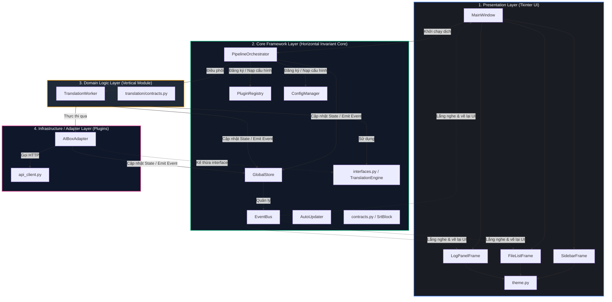

# Phân Tích Kiến Trúc SRT Subtitle Translator (Architectural Views Report)

Báo cáo này phân tích hệ thống **SRT Subtitle Translator** qua các góc nhìn kiến trúc phần mềm chuẩn hóa (mô hình 4+1 Architectural Views), giúp nhìn rõ cả cấu trúc logic lúc phát triển (development-time) và cơ chế vận hành vật lý lúc chạy (runtime).

---

## 1. GÓC NHÌN LOGIC (Logical View)
Góc nhìn logic mô tả cấu trúc phân lớp chức năng của hệ thống và cách các thành phần giao tiếp với nhau qua các giao thức/hợp đồng (Contracts & Interfaces), tuân thủ nguyên lý đảo ngược phụ thuộc (Dependency Inversion Principle - DIP).



---

## 2. GÓC NHÌN PHÁT TRIỂN / TRIỂN KHAI MÃ NGUỒN (Development / Implementation View)
Góc nhìn này mô tả cấu trúc thư mục repo vật lý trên đĩa cứng ở giai đoạn lập trình. Nó chỉ ra ranh giới đóng gói giữa các packages, modules và chiều phụ thuộc import (Import Dependency flow) giữa các file code để đảm bảo tính module hóa.

```mermaid
graph TD
    subgraph RepoRoot ["Thư Mục Gốc: srt-translator-refactored/"]
        style RepoRoot fill:#0f172a,stroke:#64748b,stroke-width:2px
        RunBat[run.bat]
        PyProject[pyproject.toml]
        
        subgraph AppFolder ["app/ (Core & UI Package)"]
            style AppFolder fill:#1e293b,stroke:#3b82f6,stroke-width:1.5px
            MainPy[main.py]
            
            subgraph AppCore ["app/core/ (Logic Lõi Hệ Thống)"]
                CoreContracts[contracts.py]
                CoreInterfaces[interfaces.py]
                StorePy[store.py]
                PipelinePy[pipeline.py]
                RegistryPy[plugin_registry.py]
                ConfigPy[config_manager.py]
                UpdaterPy[updater.py]
            end
            
            subgraph AppUI ["app/ui/ (Presentation/Tkinter View Components)"]
                MWPy[main_window.py]
                SBPy[sidebar.py]
                FLPy[file_list.py]
                LPPy[log_panel.py]
                ThemePy[theme.py]
            end
            
            subgraph AppUtils ["app/utils/ (Bộ Tiện Ích Đọc/Ghi Phụ Đề)"]
                SrtIo[srt_io.py]
            end
        end

        subgraph ModulesFolder ["modules/ (Domain Nghiệp Vụ - Vertical Slices)"]
            style ModulesFolder fill:#111827,stroke:#f59e0b,stroke-width:1.5px
            
            subgraph TranslationModule ["modules/translation/"]
                EnginePy[engine.py]
                TransContracts[contracts.py]
                WorkerPy[worker.py]
                
                subgraph PluginsFolder ["modules/translation/plugins/ (Thư mục mở rộng adapters)"]
                    subgraph AIBoxPlugin ["aibox/"]
                        Toml[plugin.toml]
                        Adapter[adapter.py]
                        Client[api_client.py]
                    end
                end
            end
        end
    end

    %% Luồng phụ thuộc import (Import Dependencies)
    MainPy -->|import| MWPy & ConfigPy
    MWPy -->|import| SBPy & FLPy & LPPy & ThemePy & PipelinePy & WorkerPy & UpdaterPy
    PipelinePy -->|import| StorePy & SrtIo
    WorkerPy -->|import| StorePy & RegistryPy & TransContracts & CoreContracts
    RegistryPy -->|import| CoreContracts & CoreInterfaces
    Adapter -->|import| CoreContracts & EnginePy & Client
    EnginePy -->|import / re-expose| CoreInterfaces
    SrtIo -->|import| CoreContracts
```



---

## 3. GÓC NHÌN TIẾN TRÌNH / TƯƠNG ĐỒNG (Process / Concurrency View)
Góc nhìn này mô tả chi tiết khía cạnh runtime của ứng dụng. Đây là nơi thể hiện rõ nét nhất **3 Cấp độ ranh giới vật lý** và cơ chế giao tiếp giữa chúng:

*   **Cấp độ 1: Luồng thực thi (Thread-Level Boundary):** Ranh giới trong cùng một tiến trình, chia sẻ chung không gian địa chỉ bộ nhớ Heap, giao tiếp qua Shared Memory (bảo vệ bằng Mutex) hoặc Message Queue.
*   **Cấp độ 2: Tiến trình (OS Process-Level Boundary):** Ranh giới cô lập bộ nhớ của hệ điều hành. Các tiến trình giao tiếp qua IPC (Inter-Process Communication) hoặc các socket cục bộ.
*   **Cấp độ 3: Mạng / Thiết bị (OS Network-Level Boundary):** Ranh giới kết nối ra ngoài hệ thống cục bộ tới Internet hoặc các dịch vụ đám mây thông qua giao thức mạng (HTTPS).

```mermaid
graph TB
    subgraph InternetContext ["CẤP ĐỘ 3: MẠNG NGOÀI (External Network Boundary - HTTPS)"]
        style InternetContext fill:#172554,stroke:#2563eb,stroke-width:2px
        AIBoxAPI["AI-Box API Server (https://api.ai-box.vn)"]
        GitHub["GitHub Release Server (https://api.github.com)"]
    end

    subgraph OSContext ["CẤP ĐỘ 2: HỆ ĐIỀU HÀNH & TIẾN TRÌNH (OS & Process Boundary)"]
        style OSContext fill:#0f172a,stroke:#3b82f6,stroke-width:3px
        
        DiskPersist["Đĩa Cứng (Local File System I/O)"]
        LocalSocket["OS Local Port Bind: 127.0.0.1:54321 (Single Instance Lock)"]

        subgraph SingleProcess ["Tiến Trình Chạy Duy Nhất: python.exe (PID: 1234)"]
            style SingleProcess fill:#111827,stroke:#10b981,stroke-width:2px
            
            subgraph HeapMemory ["CẤP ĐỘ 1: VÙNG NHỚ DÙNG CHUNG (Process Shared Memory/Heap)"]
                style HeapMemory fill:#1e1b4b,stroke:#818cf8,stroke-width:1.5px
                Store["GlobalStore State: {files, is_running, progress...}"]
                Mutex["_state_lock (threading.Lock Mutex)"]
                EBus["EventBus (Pub/Sub Listener Registry)"]
            end

            subgraph MainThread ["Luồng 1: Main Thread (UI Event Loop)"]
                style MainThread fill:#1c1917,stroke:#d97706,stroke-width:1px
                TkLoop["Tkinter mainloop()"]
                UIComponents["MainWindow, Sidebar, FileList, LogPanel"]
                TkQueue["Tkinter after() Queue (Thread-Safe UI Bridge)"]
            end

            subgraph PipelineThread ["Luồng 2: Background Pipeline Thread"]
                style PipelineThread fill:#064e3b,stroke:#059669,stroke-width:1px
                Orchestrator["PipelineOrchestrator: _run_pipeline()"]
            end

            subgraph ThreadPool ["Nhóm 3: Background Worker Thread Pool (ThreadPoolExecutor)"]
                style ThreadPool fill:#450a0a,stroke:#dc2626,stroke-width:1px
                Worker1["API Key Thread 1"]
                Worker2["API Key Thread 2"]
                WorkerN["API Key Thread N"]
            end
        end
    end

    %% Giao tiếp Cấp độ 2 (OS/Process Level)
    SingleProcess -->|Khởi chạy: bind socket| LocalSocket
    Orchestrator -->|Đọc/Ghi File & Checkpoint| DiskPersist
    UIComponents -->|Nạp cấu hình lúc mở app| DiskPersist

    %% Giao tiếp Cấp độ 3 (Network Level)
    Worker1 & Worker2 & WorkerN -->|HTTPS POST Requests| AIBoxAPI
    UIComponents -->|Kiểm tra cập nhật bất đồng bộ| GitHub

    %% Giao tiếp Cấp độ 1 (Thread/Memory Level)
    MainThread -.->|Khởi chạy thread phụ| PipelineThread
    PipelineThread -.->|Tạo pool song song| ThreadPool
    
    %% Đồng bộ hóa bộ nhớ giữa các luồng
    ThreadPool -->|Cập nhật checkpoint_map| Mutex
    PipelineThread & ThreadPool -->|Ghi log/Cập nhật tiến độ| Mutex
    Mutex -->|Bảo vệ dữ liệu| Store
    
    %% Cơ chế Thread-to-UI Bridge (EventBus -> after queue -> UI loop)
    PipelineThread & ThreadPool -.->|Phát sự kiện| EBus
    EBus -.->|Chuyển tiếp qua callback| TkQueue
    TkQueue -->|Xếp hàng tin nhắn vẽ lại UI| TkLoop
    TkLoop -->|Cập nhật trạng thái hiển thị| UIComponents
```



---

## 4. GÓC NHÌN TRIỂN KHAI VẬT LÝ HẠ TẦNG (Deployment View)
Góc nhìn này mô tả sự phân bổ vật lý của ứng dụng khi được cài đặt trên máy tính của người dùng cuối. Nó chỉ ra vị trí các thư mục hệ thống, tệp cấu hình, tệp tạm thời và cách phần mềm tự phục hồi thông qua cấu trúc thư mục lưu đĩa.

```mermaid
graph TD
    subgraph UserMachine ["Máy Tính Người Dùng (User Local Computer)"]
        style UserMachine fill:#111827,stroke:#3b82f6,stroke-width:2px
        
        subgraph InstallationDir ["Thư mục cài đặt: /srt-translator-refactored/"]
            style InstallationDir fill:#1e293b,stroke:#10b981,stroke-width:1.5px
            RunApp["run.bat (Script khởi chạy cô lập venv)"]
            ConfigJson["config.json (Cấu hình người dùng lưu trữ)"]
            AppSrc["app/ & modules/ (Mã nguồn & Plugins)"]
            VenvDir[".venv/ (Môi trường ảo Python cô lập)"]
        end
        
        subgraph TempDir ["Thư mục lưu trữ tạm thời: /storage/"]
            style TempDir fill:#1c1917,stroke:#f59e0b,stroke-width:1.5px
            subgraph CheckpointDir ["checkpoints/"]
                CP1["[MD5_Hash_1].json (Lưu vết dịch tệp 1)"]
                CP2["[MD5_Hash_2].json (Lưu vết dịch tệp 2)"]
            end
        end
        
        subgraph OutputDir ["Đường dẫn lưu kết quả (Cùng thư mục file gốc hoặc tùy chỉnh)"]
            Outputs["translated_[LANG]_[FILENAME].srt"]
        end
    end

    %% Tương tác vật lý
    RunApp -->|1. Kích hoạt| VenvDir
    VenvDir -->|2. Thực thi| AppSrc
    AppSrc -->|3. Đọc/Ghi cài đặt| ConfigJson
    AppSrc -->|4. Lưu tiến trình chống crash| CheckpointDir
    AppSrc -->|5. Xuất file phụ đề đã dịch| OutputDir
```



---

## 5. VÒNG ĐỜI TRẠNG THÁI VÀ LUỒNG DỮ LIỆU CỦA FILE PHỤ ĐỀ (Subtitle Data Flow & State Lifecycle)

Sơ đồ trạng thái mô tả vòng đời của một file phụ đề đi qua các bộ lọc và các bước tự phục hồi trong hệ thống.

```mermaid
stateDiagram-v2
    [*] --> Added : Người dùng thêm file SRT vào FileList
    Added --> Waiting : Bấm nút "Bắt đầu Dịch"
    
    state Waiting {
        [*] --> LoadCheckpoint : Nạp checkpoint từ storage/checkpoints/
        LoadCheckpoint --> HasCheckpoint : Tìm thấy file JSON trùng khớp MD5
        LoadCheckpoint --> NoCheckpoint : Không có file checkpoint
    }

    HasCheckpoint --> Translating : Khôi phục tiến trình cũ & Dịch tiếp các dòng còn thiếu
    NoCheckpoint --> Translating : Bắt đầu dịch từ block số 1
    
    state Translating {
        [*] --> Batching : Cắt file thành các cụm (Batch Size = 45)
        Batching --> ParallelSending : Gửi song song qua các API Key
        ParallelSending --> APIResponse : Nhận kết quả từ AI-Box API
        
        state APIResponse {
            [*] --> Verification : Chạy hàm _is_untranslated()
            Verification --> ValidResult : Đạt yêu cầu (Không còn chữ nguồn, không rỗng)
            Verification --> InvalidResult : Lỗi (Rỗng, trùng lặp, sót chữ nguồn)
            
            state InvalidResult {
                [*] --> ImmediateRetry : Layer 1b (Dịch lại ngay lập tức)
                ImmediateRetry --> Reverify : Kiểm tra lại
                Reverify --> ValidResult : Thành công
                Reverify --> FailToHeal : Vẫn lỗi
            }
        end

        ValidResult --> SaveTemp : Ghi nhận vào Checkpoint JSON trên đĩa
        FailToHeal --> CollectFailures : Gom các blocks lỗi để xử lý sau
        
        SaveTemp --> CheckAllDone : Còn block nào chưa xử lý?
        CollectFailures --> CheckAllDone
        
        CheckAllDone --> Batching : Tiếp tục lô tiếp theo
        CheckAllDone --> MultiPassHealing : Đã quét xong lượt 1 (Còn block lỗi)
        
        state MultiPassHealing {
            [*] --> MainModelHeal : Layer 3 (Dịch bù 2 vòng với model chính)
            MainModelHeal --> CascadeHeal : Layer 4 (Dịch bù với model dự phòng Cascade)
            CascadeHeal --> MergeResults : Hoàn tất phục hồi (Chấp nhận giữ gốc nếu vẫn hỏng)
        }
        
        CheckAllDone --> MergeResults : Quét xong lượt 1 (Không còn block lỗi)
    }

    Translating --> WritingOutput : Hoàn thành dịch toàn bộ blocks
    WritingOutput --> CleanUp : Ghi file SRT đầu ra thành công
    CleanUp --> Completed : Xóa file checkpoint JSON trên đĩa
    Completed --> [*]
    
    Translating --> Stopped : Người dùng bấm "Dừng khẩn cấp" (stop_flag = True)
    Stopped --> [*] : Giữ nguyên checkpoint để khôi phục sau
```
